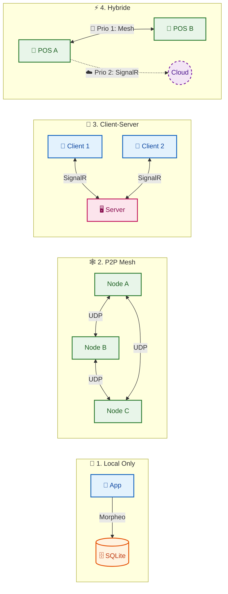
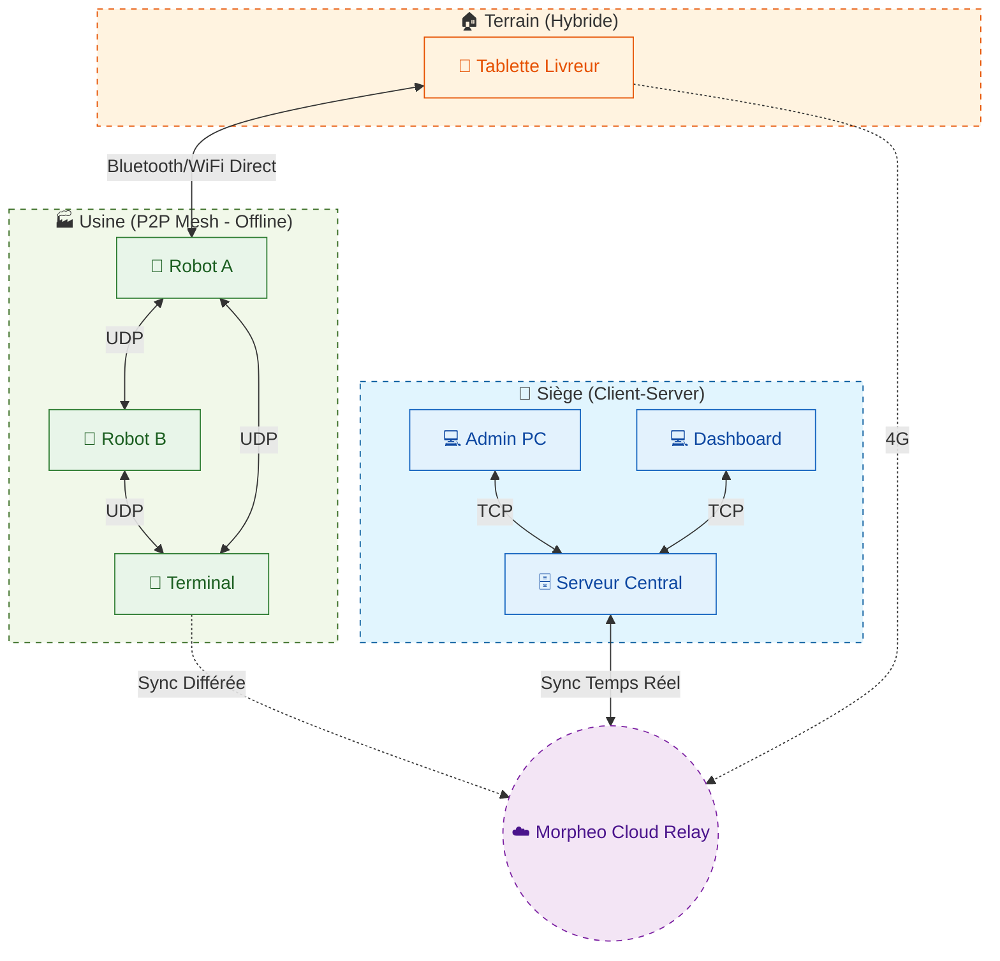
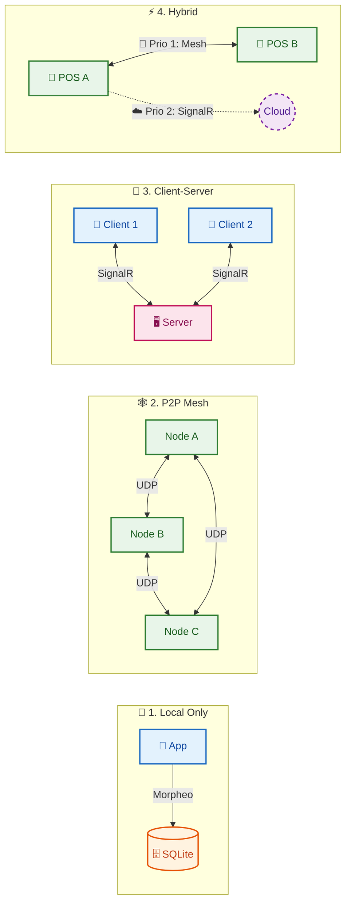

# Morpheo Framework

   

**Morpheo est un Framework de Synchronisation de Données Distribuées (.NET 10).**

> **Vision & Philosophie : Ne pas réinventer la roue, mais la faire tourner plus vite.**
> Morpheo transforme des architectures client-serveur fragiles en systèmes distribués, auto-organisés et indestructibles. Il permet à vos applications d'être "Offline-First" et "Local-First" tout en garantissant une cohérence éventuelle forte à travers un maillage de nœuds.

---

## 📑 Table des Matières
- [Architecture](#-architecture)
- [Vision & Philosophie](#-vision--philosophie)
- [Topologies de Déploiement](#-les-4-topologies-de-déploiement)
- [Fonctionnalités Clés & Comparatif](#-fonctionnalités-clés)
- [Performance & Benchmarks](#-performance--benchmarks)
- [Impression Distribuée](#%EF%B8%8F-impression-distribuée)
- [Orchestration & Code](#-orchestration--code)
- [Démarrage Rapide](#-démarrage-rapide)
- [Roadmap & Futur](#%EF%B8%8F-roadmap--futur)
- [Développement & Contribution](#%EF%B8%8F-développement--contribution)
- [Licence](#-licence)

---

## 🏗 Architecture

La solution est organisée en composants modulaires conçus pour la flexibilité :

- **`Morpheo.Core`** : Le moteur (Horloges Vectorielles, Arbres de Merkle, CRDTs).
- **`Morpheo.Sdk`** : Contrats publics et interfaces d'intégration.
- **`Morpheo.Tests`** : Simulateur Réseau En Mémoire pour valider la robustesse.
- **`Morpheo.Benchmarks`** : Profilage de performance (Zero-Alloc hot paths).

---

## 🔮 Vision & Philosophie

Les applications modernes ne peuvent plus se permettre d'être "hors ligne".

**Morpheo** n'est pas une simple librairie de cache. C'est un **Orchestrateur de Cohérence de Données**. Il agit comme une couche d'abstraction intelligente qui harmonise les standards (SQLite, HTTP, UDP) pour garantir que, quoi qu'il arrive (coupure réseau, latence, crash), vos données finissent toujours par converger.

---

## 🌐 Les 4 Topologies de Déploiement

**Morpheo s'adapte à l'infrastructure, et non l'inverse.** Il suffit de configurer le Builder pour changer radicalement de topologie.



### 🌍 Exemple de Topologie Globale (Vaste Réseau)
Voici comment Morpheo connecte tout le monde ensemble :



### Guide de Choix : Quand utiliser quoi ?

> **💡 Note Importante : La Puissance de la Composition**
> Ces topologies ne sont pas mutuellement exclusives. Morpheo vous permet de **mixer** ces stratégies et de définir des ordres de priorité.
>
> *Exemple :* Vous pouvez définir une stratégie où l'application tente d'abord de synchroniser en **P2P Local (UDP)** (Priorité 1, Gratuit & Rapide), et si aucun pair n'est trouvé, elle bascule automatiquement sur le **Cloud (SignalR)** (Priorité 2, Fallback).

| Topologie | Cas d'Usage Idéal | Pourquoi ? |
| :--- | :--- | :--- |
| **Local Only** | MVP, Prototypage | "Morpheo-iser" l'app dès le début sans complexité réseau. |
| **P2P Mesh** | Usines, IoT, Zones Blanches | Résilience totale : si Internet coupe, l'usine tourne encore. |
| **Client-Serveur** | App Mobile, Web, SaaS | Modèle classique centralisé, simple à sécuriser. |
| **Hybride** | Point de Vente (POS), Santé | **Le Must.** Vitesse locale + Sécurité Cloud. |

---

## ✨ Fonctionnalités Clés

Morpheo brise les silos en combinant le meilleur de chaque technologie :

| Composant | Technologie | L'Avantage Morpheo |
| :--- | :--- | :--- |
| **Fiabilité** | SQLite / EF Core | **Solidité SQL** pour la persistance locale. |
| **Résilience** | UDP Multicast | **Zéro Config** et découverte automatique des nœuds. |
| **Efficience** | Merkle Trees | **Sync Optimisée** : transfert uniquement les deltas. |
| **Conflits** | Vector Clocks | **Résolution Mathématique** des écritures concurrentes. |

---

### Comparatif : Pourquoi Morpheo change la donne ?

| Critère | Windows Shared Printing (SMB) | Cloud Print Solutions | Morpheo Distributed Print |
| :--- | :--- | :--- | :--- |
| **Offline First** | ❌ Non (Dépend du LAN/AD) | ❌ Non (Dépend d'Internet) | ✅ **Oui** (Fonctionne en P2P local) |
| **Zéro Config** | ❌ Complexe (IP, DNS, VPN) | ❌ Lourd (Agents à installer) | ✅ **Automatique** (Découverte UDP) |
| **Traversée NAT** | ❌ Impossible sans VPN | ✅ Oui | ✅ **Oui** (Via Gossip ou Relay) |
| **Performance** | ⚠️ Lenteur RPC | ⚠️ Latence Internet | 🚀 **Temps Réel** (Stream Raw) |
| **Universel** | ❌ Windows Uniquement | ✅ Multi-platforme | ✅ **Multi-OS** (Windows/Linux/Android) |

---

## ⚡ Performance & Benchmarks

Morpheo est obsédé par la performance. il ne se contente pas de dire qu'il est rapide, il le prouve.
Voici les résultats des benchmarks officiels exécutés sur **.NET 10 (Janvier 2026)**.

**Vous pouvez trouver les résultats détaillés dans le dossier Benchmark du dépot**

### 1. Stockage : Moteur Hybride vs SQL Classique
Comparaison d'écriture brute (1000 logs) entre lz `FileLogStore` (basé sur le principe LSM Append-Only) et une insertion standard Entity Framework Core (SQLite).

| Méthode | Scénario | Temps Moyen | Allocation Mémoire | Gain |
| :--- | :--- | :--- | :--- | :--- |
| **SQLite (EF Core)** | 1000 Writes | 63.60 ms | 12.67 MB | (Baseline) |
| **Morpheo (LSM)** | 1000 Writes | **10.22 ms** | **1.36 MB** | 🚀 **x6.2 Plus Rapide** |

> **Analyse** : En évitant l'overhead relationnel et le tracking d'objets d'EF Core pour les logs immuables, Morpheo réduit la pression sur le Garbage Collector (GC) de **9.3x**.

### 2. Pipeline Complet d'Ingestion (End-to-End)
Ce test mesure le temps réel entre la réception d'une donnée, sa validation (Vector Clock), sa sécurisation (Merkle Hash) et son écriture disque.

| Pipeline | Temps Moyen | Allocation Mémoire | Ratio |
| :--- | :--- | :--- | :--- |
| **Standard (EF/SQL)** | 10,788.50 µs (~10.8 ms) | 15.89 MB | (Baseline) |
| **Morpheo (Optimisé)** | **18.12 µs** (~0.018 ms) | **0.003 MB** | ⚡ **x595 Plus Rapide** |

> **Révélation** : Le pipeline optimisé de Morpheo est **595x plus rapide** qu'une approche naïve. C'est la différence entre un système qui s'écroule sous la charge et un système temps-réel.

### 3. Résolution de Conflits (Vector Clocks)
Morpheo utilise des Vector Clocks pour déterminer la causalité sans serveur central. L'algorithme est optimisé pour être "Zero-Allocation".

| Opération | Nœuds | Temps Moyen | Mémoire |
| :--- | :--- | :--- | :--- |
| **Fusion (Merge)** | 10 | **2.48 µs** | **56 Bytes** |
| **Comparaison** | 10 | **0.30 µs** | **0 Bytes** (Zero-Alloc) |

### 4. Intégrité des Données (Merkle Trees)
Les Arbres de Merkle permettent de vérifier si deux nœuds sont synchronisés sans transférer les données.

| Nombre de Logs | Temps de Hachage (Root) | Allocation |
| :--- | :--- | :--- |
| 1 000 | 1.30 ms | 1.07 MB |
| **10 000** | **8.66 ms** | **10.75 MB** |

### 5. Optimisation Bande Passante (Compression Delta)
Mesure la génération de "Patchs" pour ne transférer que les octets modifiés d'un document JSON.

| Opération | Temps Moyen |
| :--- | :--- |
| **Générer Patch** (Diff) | 1.50 ms |
| **Appliquer Patch** | 1.15 ms |

### 6. Taxe de Sérialisation (Overhead)
Coût de transformation des objets C# en JSON pour le transport réseau.

| Scénario | Temps Moyen |
| :--- | :--- |
| **Sérialiser 1 Objet** | 3.00 µs |
| **Sérialiser Batch (1000)** | 4.50 ms |

---

## 🖨️ Impression Distribuée

Morpheo considère les imprimantes comme des nœuds du réseau. N'importe quel appareil peut imprimer sur n'importe quelle imprimante du Mesh via une découverte automatique (Zéro Driver).

### Comment ça marche ? (Code)

Fini le cauchemar des drivers. Morpheo utilise le **RAW Passthrough** (ZPL, ESC/POS).

#### 1. Côté Serveur (Le nœud qui a l'imprimante USB/Réseau)
Il suffit de déclarer que ce nœud est une "Gateway d'Impression".

```csharp
// Program.cs sur le PC Caisse
morpheo.Configure(o => o.Capabilities = NodeCapabilities.PrintGateway);

if (OperatingSystem.IsWindows())
{
    // Active le pont vers winspool.drv
    morpheo.UseNativePrinting();
}
```

#### 2. Côté Client (La Tablette qui veut imprimer)
Elle découvre les imprimantes disponibles et envoie le flux brut.

```csharp
// Sur la tablette (n'importe où dans le Mesh)
var printService = app.Services.GetRequiredService<IPrintService>();

// Trouve l'imprimante "Kitchen-Prnt-01" n'importe où sur le réseau
await printService.PrintRawAsync("Kitchen-Prnt-01", "^XA^FO50,50^ADN,36,20^FDHello Morpheo^FS^XZ");
```

---

## 🎹 Orchestration & Code

Grâce à l'injection de dépendances et au pattern Builder, la configuration est fluide et expressive. Vous définissez des **Stratégies Composites**.

### Exemple A : Démarrage Rapide (Local Only)
Idéal pour commencer un projet proprement.

```csharp
using Morpheo; // Un seul namespace pour tout gouverner

var builder = WebApplication.CreateBuilder(args);

// Configuration minimale : Persistance locale uniquement.
// Pas de réseau, pas de complexité. Juste des données propres.
builder.Services.AddMorpheo(morpheo =>
{
    morpheo.Configure(options => 
    {
        options.NodeName = "MyMorpheoNode";
        options.Role = NodeRole.StandardClient;
    });

    // 1. Stockage (Zero-Config)
    // Par défaut, stocke dans %LocalAppData%/Morpheo pour éviter les permissions denied
    morpheo.UseSqlite(); 
    morpheo.AddBlobStore();

    // 2. Moteur de Logs
    // Utilisation du mode Hybride (RAM + Disque + SQL) pour la performance
    morpheo.UseHybridLogStore();
});
```

### Exemple B : La Totale (Stratégie Mesh Hybride)
Une configuration de production "Zero-Config" prête pour le déploiement réel.

```csharp
using Morpheo;

builder.Services.AddMorpheo(morpheo =>
{
    // ... Config Identité ...
    morpheo.Configure(o => o.NodeName = "Store-POS-01");

    // 1. Stockage Explicite (Optionnel, pour le contrôle total)
    // Ici, on force un chemin spécifique dans LocalAppData pour être propre
    var appData = Environment.GetFolderPath(Environment.SpecialFolder.LocalApplicationData);
    morpheo.UseSqlite($"Data Source={Path.Combine(appData, "Morpheo", "store.db")}");
    morpheo.UseFileLogStore(); // Logs haute performance

    // 2. Réseau : Mesh P2P
    // Active la découverte UDP + Serveur Web Kestrel interne
    morpheo.AddMesh();

    // 3. Impression Native (Si sur Windows)
    if (OperatingSystem.IsWindows())
    {
        // Enregistre les services d'impression Win32 (winspool.drv)
        // Note: Accessible via builder.Services car c'est une extension IServiceCollection
        builder.Services.AddWindowsPrinting();
    }
});
```

Comparé aux solutions classiques (SMB, Cloud Print), Morpheo offre une impression **Temps Réel**, **Offline-First**, et **Sans Configuration**.

---

## 🚀 Démarrage Rapide

### Installation
```bash
dotnet add package Morpheo.Core
```

### Configuration (Standard Node)
```csharp
using Morpheo.Core;

var builder = Host.CreateDefaultBuilder();
builder.ConfigureServices(services =>
{
    services.AddMorpheo(options => 
    {
        options.NodeName = "Terminal-01";
        options.DiscoveryPort = 5000;
        // options.Role = NodeRole.StandardClient;
    })
    .UseSqlite(); // Stockage Hybride (SQL + FileSystem)
});

await builder.Build().RunAsync();
```

---

## 🗺️ Roadmap & Futur
*   **Court Terme** : Support Impression Linux (CUPS/IPP).
*   **Moyen Terme** : Universal Hardware Mesh (Partage de ports COM/Série sur IP).
*   **Long Terme** : Support WebAssembly (Blazor) pour P2P direct dans le navigateur.

---

## 🛠️ Développement & Contribution

Morpheo est conçu pour être aussi agréable à développer qu'à utiliser. Je remercie les contributions de tous horizons.

Pour garantir une expérience fluide, le repository inclut deux formats de solution :

*   **`Morpheo.sln` (Standard)** : Le format classique, compatible avec toutes les versions de Visual Studio, JetBrains Rider, et la CLI `dotnet`. C'est le choix par défaut pour la compatibilité maximale et les pipelines CI/CD.
*   **`Morpheo.slnx` (Modern)** : Le nouveau format XML de solution (.NET 10 Ready). Plus lisible, plus rapide à charger, et plus facile à merger (fini les conflits de GUIDs dans le .sln).

Je m'efforce de garder une DX (Developer Experience) de premier plan. Si vous avez des suggestions pour améliorer l'environnement de build, ouvrez une issue !

---

## 📜 Licence
Projet sous licence MIT - voir le fichier `LICENSE`.


---
---

# Morpheo Framework (English)

   

**Morpheo is a Distributed Data Synchronization Framework (.NET 10).**

> **Vision & Philosophy: Don't reinvent the wheel, make it spin faster.**
> Morpheo transforms fragile client-server architectures into resilient, self-organizing distributed systems. It enables your applications to be "Offline-First" and "Local-First" while ensuring strong eventual consistency across a mesh of nodes.

---

## 📑 Table of Contents
- [Architecture](#-architecture-1)
- [Vision & Philosophy](#-vision--philosophy-1)
- [Deployment Topologies](#-the-4-deployment-topologies)
- [Key Features & Comparison](#-key-features)
- [Performance & Benchmarks](#-performance--benchmarks-1)
- [Distributed Printing](#%EF%B8%8F-distributed-printing)
- [Orchestration & Code](#-orchestration--code-1)
- [Getting Started](#-getting-started)
- [Roadmap & Future](#%EF%B8%8F-roadmap--future)
- [Development & Contribution](#%EF%B8%8F-development--contribution)
- [License](#-license-1)

---

## 🏗 Architecture

The solution is organized into modular components designed for flexibility:

- **`Morpheo.Core`**: The engine (Vector Clocks, Merkle Trees, CRDTs).
- **`Morpheo.Sdk`**: Public contracts and integration interfaces.
- **`Morpheo.Tests`**: In-Memory Network Simulator to validate robustness.
- **`Morpheo.Benchmarks`**: Performance profiling (Zero-Alloc hot paths).

---

## 🔮 Vision & Philosophy

Modern applications can no longer afford to be "offline".

**Morpheo** is not just a cache library. It is a **Data Consistency Orchestrator**. It acts as an smart abstraction layer that harmonizes standards (SQLite, HTTP, UDP) to ensure that, whatever happens (network outage, latency, crash), your data always converges.

---

## 🌐 The 4 Deployment Topologies

**Morpheo adapts to the infrastructure, not the other way around.** You just need to configure the Builder to radically change topology.



### 🌍 Global Topology Example (Wide Network)
Here is how Morpheo connects everyone together:


### Selection Guide: When to use what?

> **💡 Important Note: The Power of Composition**
> These topologies are not mutually exclusive. Morpheo allows you to **mix** these strategies and define priority orders.
>
> *Example:* You can define a strategy where the application first attempts to synchronize via **Local P2P (UDP)** (Priority 1, Free & Fast), and if no peer is found, it automatically switches to **Cloud (SignalR)** (Priority 2, Fallback).

| Topology | Ideal Use Case | Why? |
| :--- | :--- | :--- |
| **Local Only** | MVP, Prototyping | "Morpheo-ize" the app from the start without network complexity. |
| **P2P Mesh** | Factories, IoT, Dead Zones | Total resilience: if Internet cuts, the factory still runs. |
| **Client-Server** | Mobile App, Web, SaaS | Classic centralized model, simple to secure. |
| **Hybrid** | Point of Sale (POS), Healthcare | **The Must.** Local speed + Cloud security. |

---

## ✨ Key Features

Morpheo breaks silos by combining the best of each technology:

| Component | Technology | Morpheo Advantage |
| :--- | :--- | :--- |
| **Reliability** | SQLite / EF Core | **SQL Solidity** for local persistence. |
| **Resilience** | UDP Multicast | **Zero Config** and automatic node discovery. |
| **Efficiency** | Merkle Trees | **Optimized Sync**: transfers only deltas. |
| **Conflicts** | Vector Clocks | **Mathematical Resolution** of concurrent edits. |

---

### Comparison: Why Morpheo changes the game?

| Criterion | Windows Shared Printing (SMB) | Cloud Print Solutions | Morpheo Distributed Print |
| :--- | :--- | :--- | :--- |
| **Offline First** | ❌ No (Depends on LAN/AD) | ❌ No (Depends on Internet) | ✅ **Yes** (Works in local P2P) |
| **Zero Config** | ❌ Complex (IP, DNS, VPN) | ❌ Heavy (Agents to install) | ✅ **Automatic** (UDP Discovery) |
| **NAT Traversal** | ❌ Impossible without VPN | ✅ Yes | ✅ **Yes** (Via Gossip or Relay) |
| **Performance** | ⚠️ Slow RPC | ⚠️ Internet Latency | 🚀 **Real-Time** (Raw Stream) |
| **Universal** | ❌ Windows Only | ✅ Multi-platform | ✅ **Multi-OS** (Windows/Linux/Android) |

---

## ⚡ Performance & Benchmarks

Morpheo is obsessed with performance. He don't just say he's fast; he prove it.
Here are the official benchmark results run on **.NET 10 (January 2026)**.

**You can find all details results in benchmark folder of repository**

### 1. Storage: Hybrid Engine vs Classic SQL
Comparison of raw writes (1000 logs) between `FileLogStore` (LSM Append-Only) and a standard Entity Framework Core insertion (SQLite).

| Method | Scenario | Mean Time | Memory Allocated | Gain |
| :--- | :--- | :--- | :--- | :--- |
| **SQLite (EF Core)** | 1000 Writes | 63.60 ms | 12.67 MB | (Baseline) |
| **Morpheo (LSM)** | 1000 Writes | **10.22 ms** | **1.36 MB** | 🚀 **x6.2 Faster** |

> **Analysis**: By avoiding relational overhead and EF Core tracking for immutable logs, Morpheo reduces Garbage Collector (GC) pressure by **9.3x**.

### 2. End-to-End Ingestion Pipeline
This test measures the real time between data reception, validation (Vector Clock), security (Merkle Hash), and disk write.

| Pipeline | Mean Time | Memory Allocated | Ratio |
| :--- | :--- | :--- | :--- |
| **Standard (EF/SQL)** | 10,788.50 µs (~10.8 ms) | 15.89 MB | (Baseline) |
| **Morpheo (Optimized)** | **18.12 µs** (~0.018 ms) | **0.003 MB** | ⚡ **x595 Faster** |

> **Revelation**: Morpheo's optimized pipeline is **595x faster** than a naive approach. This is the difference between a system that crumbles under load and a real-time system.

### 3. Conflict Resolution (Vector Clocks)
Morpheo uses Vector Clocks to determine causality without a central server. The algorithm is optimized to be "Zero-Allocation".

| Operation | Nodes | Mean Time | Memory |
| :--- | :--- | :--- | :--- |
| **Merge** | 10 | **2.48 µs** | **56 Bytes** |
| **CompareTo** | 10 | **0.30 µs** | **0 Bytes** (Zero-Alloc) |

### 4. Data Integrity (Merkle Trees)
Merkle Trees allow verifying if two nodes are in sync without transferring data.

| Log Count | Hashing Time (Root) | Allocation |
| :--- | :--- | :--- |
| 1,000 | 1.30 ms | 1.07 MB |
| **10,000** | **8.66 ms** | **10.75 MB** |

### 5. Bandwidth Optimization (Delta Compression)
Measures the generation of "Patches" to transfer only modified bytes of a JSON document.

| Operation | Mean Time |
| :--- | :--- |
| **Generate Patch** (Diff) | 1.50 ms |
| **Apply Patch** | 1.15 ms |

### 6. Serialization Tax (Overhead)
Cost of transforming C# objects into JSON for network transport.

| Scenario | Mean Time |
| :--- | :--- |
| **Serialize 1 Object** | 3.00 µs |
| **Serialize Batch (1000)** | 4.50 ms |

---

## 🖨️ Distributed Printing

Morpheo considers printers as network nodes. Any device can print to any printer in the Mesh via automatic discovery (Zero Driver).

### How does it work? (Code)

No more driver nightmares. Morpheo uses **RAW Passthrough** (ZPL, ESC/POS).

#### 1. Server Side (The node with the USB/Network printer)
Simply declare that this node is a "Print Gateway".

```csharp
// Program.cs on the POS PC
morpheo.Configure(o => o.Capabilities = NodeCapabilities.PrintGateway);

if (OperatingSystem.IsWindows())
{
    // Enables the bridge to winspool.drv
    morpheo.UseNativePrinting();
}
```

#### 2. Client Side (The Tablet that wants to print)
It discovers available printers and sends the raw stream.

```csharp
// On the tablet (anywhere in the Mesh)
var printService = app.Services.GetRequiredService<IPrintService>();

// Finds the printer "Kitchen-Prnt-01" anywhere on the network
await printService.PrintRawAsync("Kitchen-Prnt-01", "^XA^FO50,50^ADN,36,20^FDHello Morpheo^FS^XZ");
```

---

## 🎹 Orchestration & Code

Thanks to dependency injection and the Builder pattern, configuration is fluid and expressive. You define **Composite Strategies**.

### Example A: Quick Start (Local Only)
Ideal for starting a project cleanly.

```csharp
using Morpheo; // One namespace to rule them all

var builder = WebApplication.CreateBuilder(args);

// Minimal setup: Local persistence only.
// No network, no complexity. Just clean data.
builder.Services.AddMorpheo(morpheo =>
{
    morpheo.Configure(options => 
    {
        options.NodeName = "MyMorpheoNode";
        options.Role = NodeRole.StandardClient;
    });

    // 1. Storage (Zero-Config)
    // Defaults to %LocalAppData%/Morpheo to avoid permission denied
    morpheo.UseSqlite(); 
    morpheo.AddBlobStore();

    // 2. Log Engine
    // Uses Hybrid mode (RAM + Disk + SQL) for performance
    morpheo.UseHybridLogStore();
});
```

### Example B: The Full Package (Hybrid Mesh Strategy)
A "Zero-Config" production setup ready for real-world deployment.

```csharp
using Morpheo;

builder.Services.AddMorpheo(morpheo =>
{
    // ... Identity Config ...
    morpheo.Configure(o => o.NodeName = "Store-POS-01");

    // 1. Explicit Storage (Optional, for total control)
    // Here, we force a specific path in LocalAppData
    var appData = Environment.GetFolderPath(Environment.SpecialFolder.LocalApplicationData);
    morpheo.UseSqlite($"Data Source={Path.Combine(appData, "Morpheo", "store.db")}");
    morpheo.UseFileLogStore(); // High-performance logs

    // 2. Network: P2P Mesh
    // Enables UDP discovery + Internal Kestrel Web Server
    morpheo.AddMesh();

    // 3. Native Printing (If on Windows)
    if (OperatingSystem.IsWindows())
    {
        // Registers Win32 print services (winspool.drv)
        // Note: Accessible via builder.Services as it is an IServiceCollection extension
        builder.Services.AddWindowsPrinting();
    }
});
```

Compared to classic solutions (SMB, Cloud Print), Morpheo offers **Real-Time**, **Offline-First**, and **Configuration-Free** printing.

---

## 🚀 Getting Started

### Installation
```bash
dotnet add package Morpheo.Core
```

### Configuration (Standard Node)
```csharp
using Morpheo.Core;

var builder = Host.CreateDefaultBuilder();
builder.ConfigureServices(services =>
{
    services.AddMorpheo(options => 
    {
        options.NodeName = "Terminal-01";
        options.DiscoveryPort = 5000;
        // options.Role = NodeRole.StandardClient;
    })
    .UseSqlite(); // Hybrid Storage (SQL + FileSystem)
});

await builder.Build().RunAsync();
```

---

## 🗺️ Roadmap & Future
*   **Short Term**: Linux Printing Support (CUPS/IPP).
*   **Mid Term**: Universal Hardware Mesh (COM/Serial port sharing over IP).
*   **Long Term**: WebAssembly Support (Blazor) for pure browser P2P sync.

---

## 🛠️ Development & Contribution

Morpheo is designed to be as enjoyable to develop as it is to use. I welcome contributions from all backgrounds.

To ensure a smooth experience, the repository includes two solution formats:

*   **`Morpheo.sln` (Standard)**: The classic format, compatible with all versions of Visual Studio, JetBrains Rider, and the `dotnet` CLI. It is the default choice for maximum compatibility and CI/CD pipelines.
*   **`Morpheo.slnx` (Modern)**: The new XML solution format (.NET 10 Ready). More readable, faster to load, and easier to merge (no more GUID conflicts in the .sln).

I strive to keep a top-tier DX (Developer Experience). If you have suggestions to improve the build environment, open an issue!

---

## 📜 License
Project licensed under MIT - see the `LICENSE` file.
