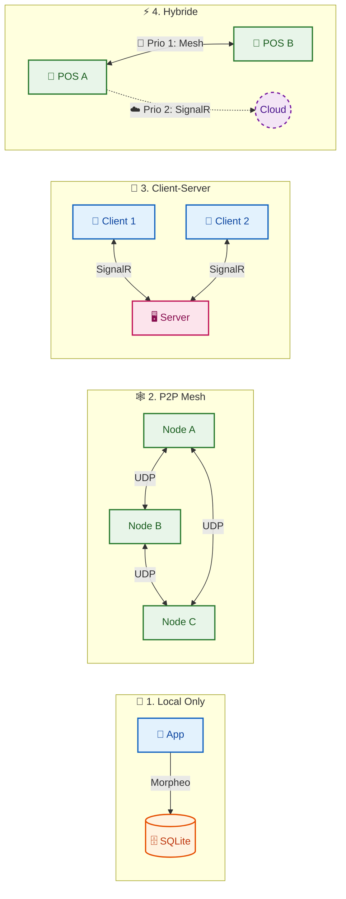
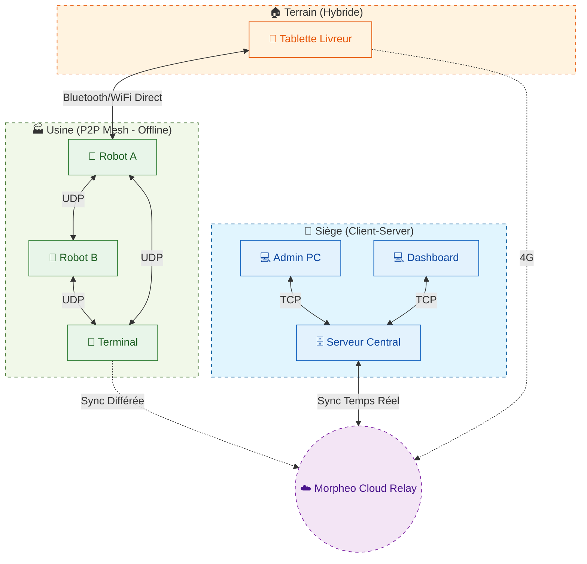

# Morpheo Framework : Orchestrateur de Synchronisation Universel pour .NET

[](https://www.nuget.org/packages/Morpheo.Core/)
[](./LICENSE)
[](https://dotnet.microsoft.com/)
[]()

> **Vision & Philosophie : Ne pas réinventer la roue, mais la faire tourner plus vite.**

---

## 📑 Table des Matières

- [🚀 Installation Rapide](#-installation-rapide)
- [🔮 Vision & Philosophie](#-vision--philosophie--lharmonie-des-standards)
- [💎 Pourquoi Morpheo est Unique ?](#-pourquoi-morpheo-est-unique-)
- [🌐 Les 4 Topologies de Déploiement](#-les-4-topologies-de-déploiement)
- [🖨️ Impression Distribuée & Hardware](#️-impression-distribuée--hardware)
- [🎹 Orchestration & Code](#-orchestration--code)
- [🛠️ Développement & Contribution](#️-développement--contribution)
- [🗺️ Roadmap & Futur](#️-roadmap--futur)
- [🏁 Conclusion](#-conclusion)

---

## � Installation Rapide

Commencez à synchroniser vos données en moins de 30 secondes.

```bash
dotnet add package Morpheo.Core
# Ou via la console PackageManager :
# Install-Package Morpheo.Core
```

---

## 🔮 Vision & Philosophie : L'Harmonie des Standards

Dans le paysage moderne du développement logiciel, la continuité de service n'est plus une option, c'est une exigence. Les applications ne peuvent plus se permettre d'être "hors ligne". Cependant, construire des systèmes distribués capables de maintenir une cohérence stricte des données à travers des réseaux instables est l'un des défis les plus ardus de l'informatique.

**Morpheo** n'est pas simplement une bibliothèque de cache ou un client API amélioré. C'est un **Orchestrateur de Cohérence de Données**. Il décomplexifie des processus d'intégration complexes pour permettre une cohérence des données dans des conditions de réseaux instables.

Il permet donc au développeur de se concentrer sur la logique métier de son application, sans se soucier des détails de la synchronisation.

Ma philosophie est simple : **Ne pas réinventer la roue, mais la faire tourner plus vite.**
Morpheo ne cherche pas à remplacer vos bases de données (SQLite, PostgreSQL) ou vos protocoles (HTTP, TCP).

Il agit comme une couche d'abstraction intelligente qui harmonise ces standards pour garantir que, quoi qu'il arrive (coupure réseau, latence, crash), vos données finissent toujours par converger vers un état cohérent.

---

## 💎 Pourquoi Morpheo est Unique ?

Morpheo brise les silos en faisant dialoguer des technologies qui s'ignorent habituellement. Il tire le "meilleur de tous les mondes" là où d'autres frameworks vous enferment dans un seul paradigme.

### Feature Matrix : L'Assemblage Intelligent

| Composant | Technologie Standard | L'Avantage Morpheo |
| :--- | :--- | :--- |
| **Fiabilité Transactionnelle** | SQLite / EF Core | **Solidité SQL** pour la persistance locale et l'archivage. |
| **Vitesse & Résilience** | UDP Multicast & Gossip | **Zéro Latence** en local et indépendance totale d'Internet. |
| **Portée Globale** | SignalR / WebSockets | **Accessibilité Cloud** pour synchroniser les mobiles distants. |
| **Intégrité des Données** | Merkle Trees | **Réconciliation Efficace** : on ne transfère que ce qui manque. |
| **Causalité Distribuée** | Vector Clocks | **Résolution de Conflits** mathématique (qui a écrit avant qui ?). |
| **Stockage** | LSM-Tree (Log Structured) | **Écriture Crash-Safe** et ultra-rapide (Append-Only). |

---

## 🌐 Les 4 Topologies de Déploiement

**Morpheo s'adapte à l'infrastructure, et non l'inverse.** Il suffit de configurer le Builder pour changer radicalement de topologie.



### 🌍 Exemple de Topologie Globale (Vaste Réseau)
Voici comment Morpheo connecte tout le monde ensemble :



### Guide de Choix : Quand utiliser quoi ?

> **💡 Note Importante : La Puissance de la Composition**
> Ces topologies ne sont pas mutuellement exclusives. Morpheo vous permet de **mixer** ces stratégies et de définir des ordres de priorité.
>
> *Exemple :* Vous pouvez définir une stratégie où l'application tente d'abord de synchroniser en **P2P Local (UDP)** (Priorité 1, Gratuit & Rapide), et si aucun pair n'est trouvé, elle bascule automatiquement sur le **Cloud (SignalR)** (Priorité 2, Fallback).

| Topologie | Cas d'Usage Idéal | Pourquoi ? |
| :--- | :--- | :--- |
| **Local Only** | MVP, Prototypage | "Morpheo-iser" l'app dès le début sans complexité réseau. |
| **P2P Mesh** | Usines, IoT, Zones Blanches | Résilience totale : si Internet coupe, l'usine tourne encore. |
| **Client-Serveur** | App Mobile, Web, SaaS | Modèle classique centralisé, simple à sécuriser. |
| **Hybride** | Point de Vente (POS), Santé | **Le Must.** Vitesse locale + Sécurité Cloud. |

---

## 🖨️ Impression Distribuée & Hardware

Dans la vision Morpheo, **une imprimante n'est qu'un nœud du réseau comme un autre**. N'importe quel appareil (Tablette, Téléphone) peut envoyer un ordre d'impression à n'importe quel autre nœud connecté à une imprimante (PC Caisse, Serveur), sans se soucier des drivers ou du réseau.

### Comparatif : Pourquoi Morpheo change la donne ?

| Critère | Windows Shared Printing (SMB) | Cloud Print Solutions | Morpheo Distributed Print |
| :--- | :--- | :--- | :--- |
| **Offline First** | ❌ Non (Dépend du LAN/AD) | ❌ Non (Dépend d'Internet) | ✅ **Oui** (Fonctionne en P2P local) |
| **Zéro Config** | ❌ Complexe (IP, DNS, VPN) | ❌ Lourd (Agents à installer) | ✅ **Automatique** (Découverte UDP) |
| **Traversée NAT** | ❌ Impossible sans VPN | ✅ Oui | ✅ **Oui** (Via Gossip ou Relay) |
| **Performance** | ⚠️ Lenteur RPC | ⚠️ Latence Internet | 🚀 **Temps Réel** (Stream Raw) |
| **Universel** | ❌ Windows Uniquement | ✅ Multi-platforme | ✅ **Multi-OS** (Windows/Linux/Android) |

### Comment ça marche ? (Code)

Fini le cauchemar des drivers. Morpheo utilise le **RAW Passthrough** (ZPL, ESC/POS).

#### 1. Côté Serveur (Le nœud qui a l'imprimante USB/Réseau)
Il suffit de déclarer que ce nœud est une "Gateway d'Impression".

```csharp
// Program.cs sur le PC Caisse
morpheo.Configure(o => o.Capabilities = NodeCapabilities.PrintGateway);

if (OperatingSystem.IsWindows())
{
    // Active le pont vers winspool.drv
    morpheo.UseNativePrinting();
}
```

#### 2. Côté Client (La Tablette qui veut imprimer)
Elle découvre les imprimantes disponibles et envoie le flux brut.

```csharp
// Sur la tablette (n'importe où dans le Mesh)
var printService = app.Services.GetRequiredService<IPrintService>();

// Trouve l'imprimante "Kitchen-Prnt-01" n'importe où sur le réseau
await printService.PrintRawAsync("Kitchen-Prnt-01", "^XA^FO50,50^ADN,36,20^FDHello Morpheo^FS^XZ");
```

---

## 🎹 Orchestration & Code

Grâce à l'injection de dépendances et au pattern Builder, la configuration est fluide et expressive. Vous définissez des **Stratégies Composites**.

### Exemple A : Démarrage Rapide (Local Only)
Idéal pour commencer un projet proprement.

```csharp
using Morpheo; // Un seul namespace pour tout gouverner

var builder = WebApplication.CreateBuilder(args);

// Configuration minimale : Persistance locale uniquement.
// Pas de réseau, pas de complexité. Juste des données propres.
builder.Services.AddMorpheo(morpheo =>
{
    morpheo.Configure(options => 
    {
        options.NodeName = "MyMorpheoNode";
        options.Role = NodeRole.StandardClient;
    });

    // 1. Stockage (Zero-Config)
    // Par défaut, stocke dans %LocalAppData%/Morpheo pour éviter les permissions denied
    morpheo.UseSqlite(); 
    morpheo.AddBlobStore();

    // 2. Moteur de Logs
    // Utilisation du mode Hybride (RAM + Disque + SQL) pour la performance
    morpheo.UseHybridLogStore();
});
```

### Exemple B : La Totale (Stratégie Mesh Hybride)
Une configuration de production "Zero-Config" prête pour le déploiement réel.

```csharp
using Morpheo;

builder.Services.AddMorpheo(morpheo =>
{
    // ... Config Identité ...
    morpheo.Configure(o => o.NodeName = "Store-POS-01");

    // 1. Stockage Explicite (Optionnel, pour le contrôle total)
    // Ici, on force un chemin spécifique dans LocalAppData pour être propre
    var appData = Environment.GetFolderPath(Environment.SpecialFolder.LocalApplicationData);
    morpheo.UseSqlite($"Data Source={Path.Combine(appData, "Morpheo", "store.db")}");
    morpheo.UseFileLogStore(); // Logs haute performance

    // 2. Réseau : Mesh P2P
    // Active la découverte UDP + Serveur Web Kestrel interne
    morpheo.AddMesh();

    // 3. Impression Native (Si sur Windows)
    if (OperatingSystem.IsWindows())
    {
        // Enregistre les services d'impression Win32 (winspool.drv)
        // Note: Accessible via builder.Services car c'est une extension IServiceCollection
        builder.Services.AddWindowsPrinting();
    }
});
```

---

## 🛠️ Développement & Contribution

Morpheo est conçu pour être aussi agréable à développer qu'à utiliser. Je remercie les contributions de tous horizons.

Pour garantir une expérience fluide, le repository inclut deux formats de solution :

*   **`Morpheo.sln` (Standard)** : Le format classique, compatible avec toutes les versions de Visual Studio, JetBrains Rider, et la CLI `dotnet`. C'est le choix par défaut pour la compatibilité maximale et les pipelines CI/CD.
*   **`Morpheo.slnx` (Modern)** : Le nouveau format XML de solution (.NET 10 Ready). Plus lisible, plus rapide à charger, et plus facile à merger (fini les conflits de GUIDs dans le .sln).

Je m'efforce de garder une DX (Developer Experience) de premier plan. Si vous avez des suggestions pour améliorer l'environnement de build, ouvrez une issue !

---

## 🗺️ Roadmap & Futur

Morpheo est un organisme vivant qui évolue pour répondre aux défis de demain.

### Court Terme (Q2)
*   **🔐 Hardened Security** : Intégration avancée des échanges chiffrés (End-to-End Encryption) et rotation automatique des clés de session.
*   **🐧 Linux & CUPS Support** : Support natif de l'impression sous Linux/MacOS via le protocole standard CUPS/IPP, rendant le framework 100% cross-platform.

### Moyen Terme (Research)
*   **🔌 Universal Hardware Mesh** : Au-delà de l'impression, permettre le tunneling de périphériques physiques via le Mesh.
    *   *Objectif :* Utiliser un TPE, une Balance (RS232), un lecteur Carte Vitale ou un Scanner RFID connecté sur un Nœud A depuis un Nœud B, sans configuration réseau complexe.

### Long Terme
*   **WASM Support** : Portage du Core pour exécuter Morpheo directement dans le navigateur (Blazor WebAssembly), permettant une synchro P2P pure entre clients web (via WebRTC).

---

## 🏁 Conclusion

Morpheo offre ce qui manque cruellement aux architectures modernes : la **Liberté Architecturale**.

Vous n'avez plus à choisir votre infrastructure finale au jour 1.
1.  Commencez petit (**Local Only**).
2.  Connectez vos utilisateurs (**Client-Server**).
3.  Scalez à l'infini et survivez aux pannes (**Mesh Hybride**).

Le tout, avec le même code de base, le même framework, et la même tranquillité d'esprit.

---
*Propulsé par [.NET 10](https://dotnet.microsoft.com/)*
